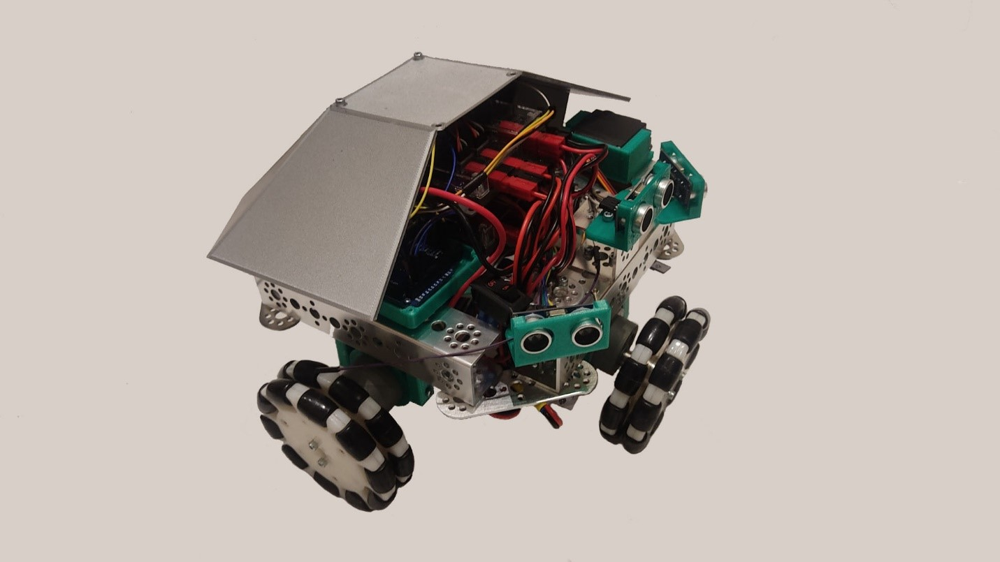

Old project for my 9'th grade school competition

Main directory - YBP

YBP/main-remotexy.ino - main file of the system, which includes:
- Bluetooth control by RemoteXY
- Control of the Tetrix drivres by I2C

Does not include, as VENICS/YBP/VENICS-TETRIX-PRIZM/VENICS-V1/VENICS-V1.ino does:
- Reading from onboard sonar modules and moving by their values

YBP/OMNI_BITE.ino - testing of I2C connection

YBP/documentation - all the information about the project (in Russian)

Photos:

